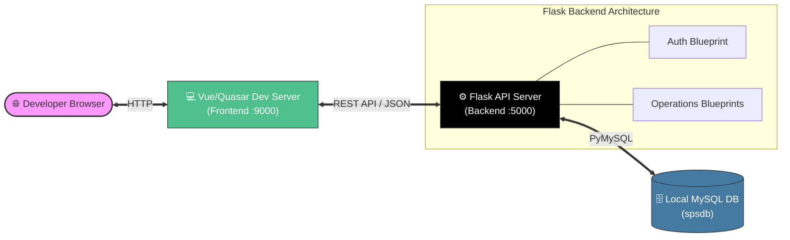
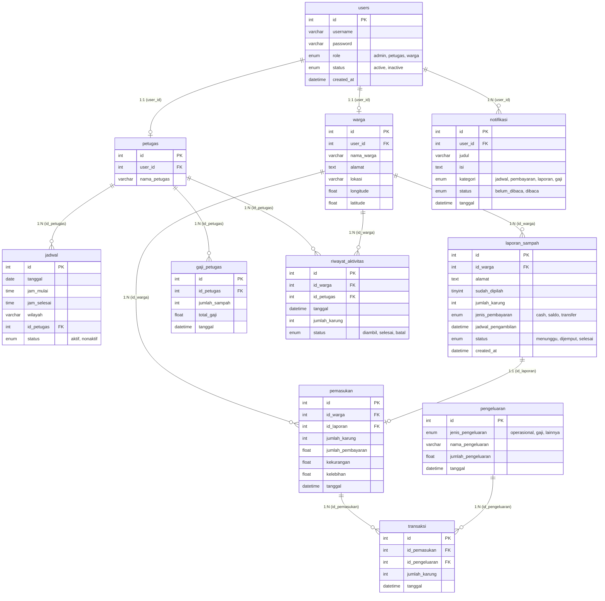

# ♻️ SPS App (Smart Payment System for Waste Management)


## 📖 Project Overview

The **SPS App (Smart Payment System for Waste Management)** is a comprehensive, full-stack platform designed to modernize and digitize waste collection ecosystems. 

This repository unifies two distinct micro-applications:
1. **Frontend (`Frontend-Apk-Sampah-Ifter`)**: A responsive, cross-platform Single Page Application (SPA) built with Vue 3 and Quasar Framework.
2. **Backend (`sps-app`)**: A robust RESTful API built with Python and Flask.

The system is designed with a strict **Role-Based Access Control (RBAC)** architecture that serves three main user personas:
- **Admin**: Oversees the entire operation, manages users, schedules pickups, tracks finances, and calculates salaries.
- **Warga (Citizens)**: Reports waste ready for pickup, tracks their request status, and manages digital payments.
- **Petugas (Officers)**: Receives schedules, executes waste collection, and tracks their accumulated salary based on the volume of waste collected.

---

## ✨ Core Features by Role

### 👨‍💼 Admin Features
- **Dashboard & Analytics**: High-level overview of total waste collected, active users, and financial health.
- **User Management**: Add, edit, and delete data for *Warga* and *Petugas*.
- **Schedule Management (`jadwal`)**: Create and assign operational zones and waste pickup schedules to specific officers.
- **Financial Control (`pemasukan`, `pengeluaran`)**: Track all income from citizens and operational expenses.
- **Salary Generator (`gaji`)**: Dynamically calculate officer salaries based on the recorded volume (sacks) of waste collected.

### 👷 Petugas (Officer) Features
- **Collection Forms**: Input forms to verify and record waste collection directly from the field.
- **Performance & Income Tracking**: View historical records of waste collected and estimated accumulated salary.

### 🏡 Warga (Citizen) Features
- **Waste Reporting**: Request a waste pickup by submitting location details and waste volume.
- **Live Tracking & Maps (`lokasi`)**: Integrated Leaflet maps to visually pinpoint waste locations.
- **Notifications**: Real-time updates on the status of their waste pickup (Waiting -> Picked Up -> Completed).

---

## 📂 Detailed Folder Structure

The workspace is strictly decoupled into a Frontend (Client) and Backend (API) architecture.

```text
.
├── Frontend-Apk-Sampah-Ifter/     # FRONTEND: Vue.js & Quasar Framework
│   ├── src/                       # Main source code
│   │   ├── pages/                 # UI Views grouped by roles
│   │   │   ├── AdminDashboard.vue, DataPetugas.vue, GajiAdmin.vue...
│   │   │   ├── PetugasDashboard.vue, FormPengambilanSampah.vue...
│   │   │   └── UserDashboard.vue, UserLaporan.vue, UserMaps.vue...
│   │   ├── layouts/               # Base page structures (AdminLayout, UserLayout)
│   │   ├── router/routes.js       # Vue Router definitions & RBAC Guards
│   │   ├── stores/                # Pinia State Management (auth, admin, notifikasi)
│   │   ├── components/            # Reusable UI components (Modals, Trackers)
│   │   └── utils/                 # Axios HTTP client configuration
│   ├── quasar.config.js           # Quasar build and development parameters
│   └── package.json               # Node.js dependencies
│
├── sps-app/                       # BACKEND: Python Flask REST API
│   ├── app.py                     # Application factory and Blueprint registration
│   ├── config.py                  # Database connection credentials
│   ├── requirements.txt           # Python dependencies
│   ├── routes/                    # API Controllers (Flask Blueprints)
│   │   ├── auth.py                # JWT Login & Registration
│   │   ├── admin.py, warga.py, petugas.py
│   │   ├── jadwal.py, laporan.py, lokasi.py
│   │   └── pemasukan.py, pengeluaran.py, gaji.py
│   └── spsdb.sql                  # MySQL database schema and seed data
│
├── start.sh                       # Unified startup bash script
└── .gitignore                     # Global gitignore configuration
```

---

## 🏗 System Architecture (Local/Development)

In the local environment, the system utilizes a standard client-server architecture communicating via RESTful JSON APIs.



---

## ☁️ System Architecture (Cloud/Production)

**TIDAK ADA (Not Configured).**

Currently, there is no explicit cloud architecture, Dockerfiles, Kubernetes manifests, or infrastructure-as-code (Terraform) configurations present in the repository. The project is currently designed to be run locally.

---

## 🗄 Database Table Relationship Diagram (TRD/ERD)

The backend utilizes a relational MySQL database. The schema is highly normalized to handle the complex financial and scheduling logic of the system.



---

## 🔌 Backend API Routes

The RESTful API is structured into several Blueprints (modules) representing different entities and business logic:

- **🔐 Auth (`/api/auth`)**
  - `POST /register`, `POST /login`, `POST /logout`
- **🏡 Warga (`/api/warga`)**
  - `GET /`, `POST /create`, `GET /<id>`, `GET /by-user/<user_id>`
- **👷 Petugas (`/api/petugas`)**
  - `GET /`, `POST /create`, `DELETE /<id>`, `GET /by-user/<user_id>`, `GET /tugas`, `POST /tugas/<id>/ambil`, `GET /rekap`
- **📅 Jadwal (`/api/jadwal`)**
  - `GET /`, `POST /`, `GET /today`, `GET /week`, `POST /multi`, `GET /list`, `GET /<id>`, `PATCH /<id>`, `PATCH /<id>/toggle-status`
- **📢 Laporan (`/api/laporan`)**
  - `GET /`, `POST /`, `GET /<id>`, `PATCH /<id>/status`
- **💰 Finance (`/api/pemasukan`, `/api/pengeluaran`, `/api/gaji`)**
  - *Pemasukan*: `GET /`, `POST /`, `GET /<id>`
  - *Pengeluaran*: `GET /`, `POST /`, `GET /<id>`
  - *Gaji*: `GET /`
- **📜 Riwayat (`/api/riwayat`, `/api/riwayat_admin`)**
  - *User/Petugas*: `GET /`, `GET /bulan-tersedia`, `GET /warga/<id>`
  - *Admin*: `GET /`
- **📍 Lokasi (`/api/lokasi`)**
  - `GET /petugas`

---

## 🛠 Tech Stack

**Frontend (Client)**
- **Framework:** Vue.js 3 & Quasar Framework
- **State Management:** Pinia
- **Routing:** Vue Router
- **HTTP Client:** Axios
- **Data Visualization:** Chart.js, ApexCharts (`vue3-apexcharts`)
- **Mapping:** Leaflet, `leaflet.awesome-markers`

**Backend (API)**
- **Framework:** Python 3 & Flask
- **CORS:** Flask-CORS
- **Authentication:** PyJWT, Werkzeug (Password Hashing)
- **Database Driver:** PyMySQL

**Database**
- **Engine:** MySQL / MariaDB

---

## 🚀 Getting Started / Installation

We have provided a fully dynamic `start.sh` script to launch both the frontend and backend automatically. 

### Prerequisites
1. **Python 3** and **Node.js (v20+)** must be installed on your system.
   > **Note:** We strongly recommend installing Node.js via [NVM (Node Version Manager)](https://github.com/nvm-sh/nvm) to avoid permission issues.
2. **MySQL** / MariaDB must be installed and running.

### Database Setup
1. Create a local MySQL database named `spsdb`.
2. Import the provided schema:
   ```bash
   cd sps-app
   mysql -u root -p spsdb < spsdb.sql
   ```
3. Update `sps-app/config.py` with your local MySQL credentials (`user`, `password`, `host`).

### Running the Application

To start both the frontend and backend simultaneously, run:

```bash
./start.sh
```

**What this dynamic script does:**
1. **Auto-Detects Environment:** It intelligently checks if Python and NPM are installed.
2. **Virtual Environment Setup:** Automatically creates a Python `venv` (handling Windows/Linux paths) and runs `pip install -r requirements.txt`.
3. **NPM Installation:** Automatically runs `npm install` if `node_modules` is missing.
4. **Execution:** Starts the **Flask API** on `http://127.0.0.1:5000` and the **Vue/Quasar Frontend** on `http://localhost:9000`.
5. **Graceful Shutdown:** Safely shuts down both servers when you press `CTRL+C`.

---

## 📄 License

*License not specified in the repository. Please contact the repository owner for licensing information.*
