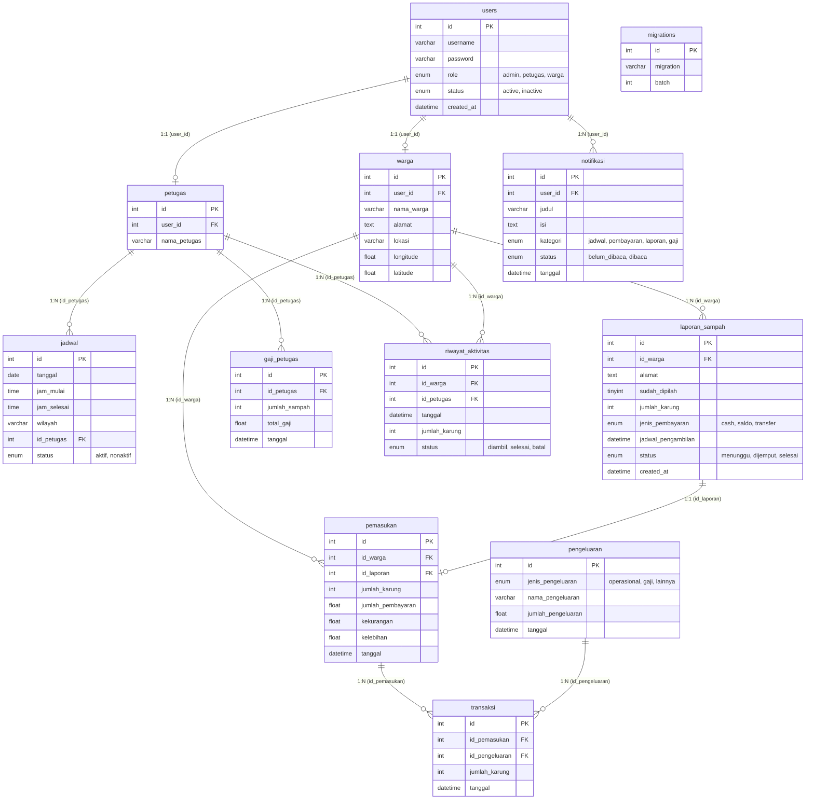

# ♻️ SPS App (Smart Payment System for Waste Management)


## 📖 Project Overview

The **SPS App (Smart Payment System for Waste Management)** is a comprehensive, full-stack platform designed to modernize and digitize waste collection. This repository contains the complete unified workspace, composed of two distinct services:
1. **Frontend (`Frontend-Apk-Sampah-Ifter`)**: A responsive, cross-platform web application built with Vue 3 and Quasar Framework.
2. **Backend (`sps-app`)**: A robust RESTful API built with Python and Flask.

The system connects citizens ("Warga"), waste collection officers ("Petugas"), and administrators. It facilitates reporting waste ready for pickup, scheduling operations, visualizing geographic locations, managing digital payments, and calculating officer compensation.

## ✨ Key Features

- **Role-Based Access Control (RBAC):** Secure JWT-based authentication tailoring the UI and API access for Admins, Citizens, and Officers.
- **Geographic Waste Tracking:** Integration with Leaflet maps to pinpoint waste pickup locations visually on the frontend.
- **Dynamic Dashboards:** Interactive data visualization using Chart.js and ApexCharts for reporting income, expenses, and operational metrics.
- **Automated Workflows:** Complete lifecycle tracking from citizen waste reports to officer pickup, automated salary calculation, and system notifications.
- **Decoupled Architecture:** Clean separation of concerns between the SPA frontend and the REST API backend.

## 📂 Folder Structure

```text
.
├── Frontend-Apk-Sampah-Ifter/  # Frontend Application (Vue.js / Quasar)
│   ├── src/                    # Source code (Components, Pages, Pinia Stores, Router)
│   ├── public/                 # Static assets
│   ├── quasar.config.js        # Quasar build and configuration parameters
│   ├── netlify.toml            # Netlify CI/CD configuration for production
│   └── package.json            # Node.js dependencies and scripts
│
└── sps-app/                    # Backend API Application (Python / Flask)
    ├── config.py               # Database and application configurations
    ├── app.py                  # Main Flask application entry point
    ├── routes/                 # API controllers (Flask Blueprints: auth, warga, petugas, dll)
    └── spsdb.sql               # MySQL database schema and seed data
```

## 🏗 System Architecture (Local/Development)

In a local development environment, the frontend runs on a Node.js development server and proxies/communicates via HTTP REST to the Flask backend running on a local Python server. The backend connects directly to a local MySQL instance.

```mermaid
flowchart TD
    Browser([Developer Browser]) <-->|HTTP :9000| Quasar[Vue/Quasar Dev Server\n(Frontend)]
    Quasar <-->|HTTP REST / JSON| Flask[Flask API\n(Backend)]
    
    subgraph Backend Services
        Flask <--> Auth[Auth Blueprint]
        Flask <--> Operations[Operations Blueprints]
    end
    
    Backend Services <-->|PyMySQL| MySQL[(Local MySQL DB\nspsdb)]
```

## ☁️ System Architecture (Cloud/Production)

Based on the environment variables and configuration files (`netlify.toml`, `.env`), the production architecture utilizes managed cloud services. The frontend is hosted statically on Netlify, while the backend API targets a cloud Python host (e.g., PythonAnywhere).

```mermaid
flowchart TD
    User([End User / Client]) <-->|HTTPS| Netlify[Netlify CDN\n(Hosts compiled SPA)]
    User <-->|HTTPS REST| PythonAnywhere[Cloud Flask API\n(e.g., PythonAnywhere)]
    
    PythonAnywhere <-->|SQL| CloudDB[(Cloud MySQL Database)]
```

## 🗄 Database Table Relationship Diagram (TRD/ERD)

The backend relies on a relational MySQL database. The following diagram illustrates the complete table schema, fields, and relationships defined in `spsdb.sql`:



## 🛠 Tech Stack

**Frontend**
- **Framework:** Vue.js 3, Quasar Framework
- **State Management:** Pinia
- **HTTP Client:** Axios
- **Data Visualization:** Chart.js, ApexCharts (`vue3-apexcharts`)
- **Mapping:** Leaflet, `leaflet.awesome-markers`

**Backend**
- **Framework:** Python 3, Flask, Flask-CORS
- **Authentication:** PyJWT, Werkzeug (Password Hashing)
- **Database Driver:** PyMySQL

**Database & Infrastructure**
- **Database:** MySQL / MariaDB
- **DevOps:** Netlify (Frontend Hosting)

## 🚀 Getting Started / Installation

You must run both the frontend and backend services simultaneously to use the application locally.

### 1. Backend Setup (`sps-app`)
1. Ensure Python 3 and MySQL are installed on your machine.
2. Navigate to the backend directory:
   ```bash
   cd sps-app
   ```
3. Create a local MySQL database named `spsdb` and import the schema:
   ```bash
   mysql -u root -p spsdb < spsdb.sql
   ```
4. Update `config.py` with your MySQL credentials.
5. Install Python dependencies:
   ```bash
   pip install Flask Flask-Cors PyMySQL PyJWT Werkzeug
   ```
6. Start the Flask API:
   ```bash
   python app.py
   ```
   *The backend will run on `http://127.0.0.1:5000`.*

### 2. Frontend Setup (`Frontend-Apk-Sampah-Ifter`)
1. Ensure Node.js (v20+) and npm are installed.
2. Open a new terminal and navigate to the frontend directory:
   ```bash
   cd Frontend-Apk-Sampah-Ifter
   ```
3. Install Node modules:
   ```bash
   npm install
   ```
4. Verify that the `.env` file points to your local backend (if testing locally, change `VITE_API_URL` to `http://127.0.0.1:5000`, otherwise it points to production).
5. Start the Quasar development server:
   ```bash
   npm run dev
   ```
   *The frontend will open in your browser automatically.*

## 🔄 CI/CD & Deployment

- **Frontend Pipeline:** The frontend utilizes Netlify for CI/CD. The `netlify.toml` file automatically triggers `quasar build` on deployment, publishing the `dist/spa` directory and handling SPA routing redirects.
- **Backend Pipeline:** Continuous Integration/Deployment is not explicitly configured in the repository (e.g., no GitHub Actions or Dockerfiles). Deployment requires manual setup of a WSGI environment or a managed cloud platform capable of running Python Flask applications.

## 📄 License

*License not specified in the repository. Please contact the repository owner for licensing information.*
