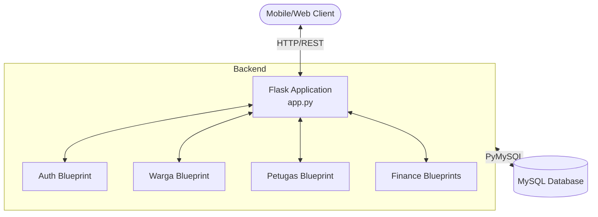
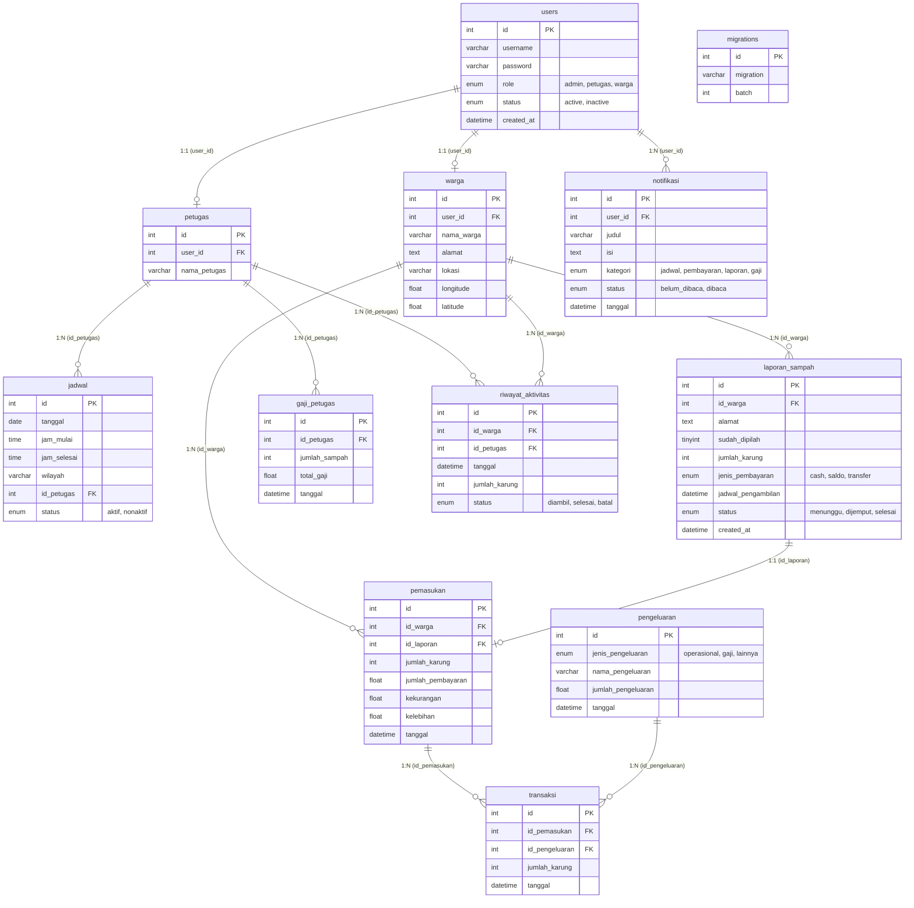

# ♻️ SPS App (Smart Payment System for Waste Management)


## 📖 Project Overview

SPS App is a backend API service built with Python and Flask. It provides the core functionality for a modern Waste Management and Smart Payment System. The platform connects citizens ("Warga") with waste collection officers ("Petugas") and administrators. It facilitates reporting waste ready for pickup, scheduling collections, managing digital payments, and calculating officer compensation based on the volume of waste collected.

## ✨ Key Features

- **Role-Based Access Control:** Secure authentication using JWT for Admins, Citizens (Warga), and Officers (Petugas).
- **Waste Collection Scheduling:** Admins can define operational schedules and assign collection zones.
- **Reporting & Tracking:** Citizens can report waste, while the system tracks the pickup lifecycle (waiting, picked up, completed).
- **Financial & Transaction Management:** Comprehensive tracking of income (from citizen payments) and expenses (including operational costs and officer salaries).
- **Automated Salary Calculation:** Dynamically calculates officer compensation based on the total volume (number of sacks) of waste collected.

## 📂 Folder Structure

```text
.
├── config.py              # Database and application configuration parameters
├── app.py                 # Main application entry point and Blueprint registration
├── routes/                # API endpoints grouped by feature (Blueprints)
│   ├── admin.py           # Admin operations
│   ├── auth.py            # Authentication, login, and registration
│   ├── gaji.py            # Officer salary processing
│   ├── jadwal.py          # Waste pickup scheduling
│   ├── laporan.py         # Waste reports from citizens
│   ├── lokasi.py          # Location mapping services
│   ├── pemasukan.py       # Income and payment tracking
│   ├── pengeluaran.py     # Expense tracking
│   ├── petugas.py         # Officer management
│   ├── riwayat.py         # General activity history
│   ├── riwayat_admin.py   # Administrative logs
│   └── warga.py           # Citizen profile management
├── jadwal.sql             # SQL dump for scheduling sample data
└── spsdb.sql              # Complete database schema and seed data
```

## 🏗 System Architecture (Local/Development)

In local development, the application operates as a standalone REST API communicating directly with a local MySQL instance.



## ☁️ System Architecture (Cloud/Production)

**Not configured.** 

There are currently no Dockerfiles, Kubernetes manifests, or infrastructure-as-code files present in the repository to define a production deployment architecture.

## 🗄 Database Table Relationship Diagram (TRD/ERD)

The following diagram maps out all tables and relationships defined in the `spsdb.sql` schema:



## 🛠 Tech Stack

- **Backend:** Python, Flask, Flask-CORS
- **Database:** MySQL / MariaDB
- **Database Driver:** PyMySQL
- **Authentication:** PyJWT, Werkzeug (Password Hashing)

## 🚀 Getting Started / Installation

Follow these steps to run the API locally:

1. **Clone the repository:**
   ```bash
   git clone <repository-url>
   cd sps-app
   ```

2. **Set up the Database:**
   - Ensure you have a local MySQL or MariaDB server running.
   - Create a new database named `spsdb`.
   - Import the provided schema:
     ```bash
     mysql -u root -p spsdb < spsdb.sql
     ```

3. **Configure the Application:**
   - Open `config.py` in the project root.
   - Update the `DB_CONFIG` dictionary with your local MySQL credentials:
     ```python
     DB_CONFIG = {
         "host": "localhost",
         "user": "root",       # Update with your MySQL user
         "password": "",       # Update with your MySQL password
         "db": "spsdb",
         "charset": "utf8mb4"
     }
     ```

4. **Install Dependencies:**
   - It's recommended to use a virtual environment. Install the required Python packages manually as no requirements file is provided:
     ```bash
     pip install Flask Flask-Cors PyMySQL PyJWT Werkzeug
     ```

5. **Run the Application:**
   ```bash
   python app.py
   ```
   - The API will be available at `http://127.0.0.1:5000/`.

## 🔄 CI/CD & Deployment

**Not configured.**
The repository does not contain `.github/workflows`, Jenkinsfiles, or other automation scripts for continuous integration and continuous deployment.

## 📄 License

*License not specified in the repository. Please contact the repository owner for licensing information.*
